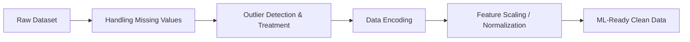

# 🐍 Python & Data Analysis Mastery Repository

<div align="center">

[](https://www.python.org/)
[](https://jupyter.org/)
[](https://pandas.pydata.org/)
[](https://seaborn.pydata.org/)
[]()
[]()

<p align="center">
  <b>A comprehensive, hands-on repository covering core Python programming, modular functions, exploratory data analysis (EDA), and advanced data preprocessing & feature engineering.</b>
</p>

[Explore Curriculum](#-curriculum--notebook-overview) • [Repository Structure](#-repository-structure) • [Getting Started](#-getting-started) • [Datasets](#-datasets-included) • [Author](#-author)

---

</div>

## 📌 Table of Contents

- [Overview](#-overview)
- [Repository Structure](#-repository-structure)
- [Curriculum & Notebook Overview](#-curriculum--notebook-overview)
  - [1. Core Python Fundamentals (`python.ipynb`)](#1-core-python-fundamentals-pythonipynb)
  - [2. Modular Programming & Functions (`function.ipynb`)](#2-modular-programming--functions-functionipynb)
  - [3. Data Analysis with Pandas (`pandas.ipynb`)](#3-data-analysis-with-pandas-pandasipynb)
  - [4. Advanced Data Preprocessing & Feature Engineering (`Exp1_Module2.ipynb`)](#4-advanced-data-preprocessing--feature-engineering-exp1_module2ipynb)
- [Datasets Included](#-datasets-included)
- [Getting Started & Installation](#-getting-started)
- [Key Features & Highlights](#-key-features--highlights)
- [Author](#-author)

---

## 📖 Overview

This repository is designed as a complete step-by-step pathway from **Python syntax and algorithms** to **applied data science & machine learning preprocessing**. Whether you are beginning your coding journey or mastering real-world data cleaning and transformation techniques, this repository provides interactive Jupyter Notebooks packed with code examples, algorithm challenges, and standard industry workflows.

---

## 📂 Repository Structure

```text
├── 📘 python.ipynb          # Core Python basics, loops, data structures & algorithm problems
├── 📙 function.ipynb        # Reusable functions, parameters, return values & modular code
├── 📗 pandas.ipynb          # Data loading, DataFrame manipulation, filtering & groupby
├── 📕 Exp1_Module2.ipynb     # Advanced data preprocessing, imputation, outliers & scaling
├── 📊 ESD.xlsx              # Employee Status/Demographics dataset (Excel)
├── 📄 employee.csv          # Sample employee dataset for quick data analysis practice
└── 📜 README.md             # Project documentation & reference guide
```

---

## 📚 Curriculum & Notebook Overview

### 1. Core Python Fundamentals (`python.ipynb`)
> **230+ interactive cells** covering pure Python concepts with practical problem-solving challenges.

* **Variables & Types:** Dynamic typing, typecasting (`int`, `float`, `str`), and subtyping.
* **User Input & Formatting:** Reading inputs and constructing console applications.
* **Operators:** Arithmetic, comparison, logical, assignment, and bitwise operations.
* **Control Flow & Decision Making:**
  * `if`, `if-else`, `if-elif-else` conditions
  * Nested conditional statements & short-hand syntax
* **Loops & Iterations:**
  * `for` loops, `while` loops, infinite loops (`while True`)
  * Loop control statements: `break`, `continue`, and `pass`
  * Nested loops and pattern generation challenges (stars, pyramids, numbers)
* **Built-in Data Structures:**
  * **Strings:** Slicing, indexing, formatting, and string manipulation methods (`count`, `capitalize`, `find`, etc.).
  * **Lists:** Slicing, list operations, built-in methods (`append`, `insert`, `pop`, `remove`, `sort`, `reverse`), and **List Comprehensions**.
  * **Tuples:** Immutability, tuple packing/unpacking, and use cases.
  * **Dictionaries:** Key-value pairs, dictionary iterations, nested dictionaries, sorting by keys/values.
* **Practical Problem Solving:**
  * Supermarket billing system simulations
  * Factorial calculations, prime checks, divisibility logic
  * Array & list manipulation problems

---

### 2. Modular Programming & Functions (`function.ipynb`)
> Focuses on writing clean, modular, and DRY (Don't Repeat Yourself) code.

* **Function Syntax & Definition:** `def` keyword, naming conventions, docstrings.
* **Parameters & Arguments:** Positional arguments, default parameters, and keyword arguments.
* **Return Values:** Returning single vs. multiple values.
* **Mathematical & Utility Functions:** Real-world reusable calculation functions (averages, sums, data transformers).

---

### 3. Data Analysis with Pandas (`pandas.ipynb`)
> Practical data exploration and tabular data analysis workflows.

* **Data Ingestion:** Reading CSV (`employee.csv`) and Excel spreadsheets (`ESD.xlsx`).
* **Exploratory Inspection:** Inspecting shape, data types, summary statistics (`head`, `tail`, `info`, `describe`).
* **Handling Missing Data:** Detecting null values (`isna`, `isnull`), dropping nulls, and baseline filling.
* **Column Transformations:** Creating computed columns, type conversion, string/numeric transformations.
* **Aggregation & Grouping:** Grouping records with `.groupby()` for multi-metric aggregation and analysis.

---

### 4. Advanced Data Preprocessing & Feature Engineering (`Exp1_Module2.ipynb`)
> Industry-grade data cleaning, outlier engineering, and normalization techniques using **Pandas**, **Seaborn**, and real-world datasets (e.g., Titanic).



* **Missing Value Imputation:**
  * Row and column removal strategies
  * Mean, Median, Mode imputation
  * Constant value imputation
  * Group-based statistical imputation (e.g., imputing age by passenger class/gender)
  * Forward Fill (`ffill`) & Backward Fill (`bfill`)
* **Outlier Detection:**
  * Box Plot & Interquartile Range (IQR) method
  * Standard Z-Score approach
  * Modified Z-Score & Percentile-based detection
* **Outlier Treatment:**
  * Trimming extreme values
  * Capping & Winsorization
  * Log transformations (squeezing right-skewed distributions)
  * Binning / Discretization
  * Robust Statistics (percentile replacement)
* **Categorical Encoding:**
  * One-Hot Encoding (`pd.get_dummies`)
  * Label Encoding
* **Feature Normalization & Scaling:**
  * Z-Score Standardization
  * Min-Max Normalization (0 to 1 scaling)
  * Decimal Scaling

---

## 📊 Datasets Included

| File | Format | Description | Used In |
| :--- | :--- | :--- | :--- |
| **`employee.csv`** | CSV | Employee records including ID, department, salary, and personal details. | `pandas.ipynb` |
| **`ESD.xlsx`** | Excel (`.xlsx`) | Employee Status Demographics dataset with multi-field attribute tracking. | `pandas.ipynb` |
| **Titanic (Built-in)** | Seaborn Dataset | Benchmark classification dataset for missing value and outlier experiments. | `Exp1_Module2.ipynb` |

---

## 🚀 Getting Started

### Prerequisites
Make sure you have **Python 3.8+** and `pip` installed on your machine.

### Installation

1. **Clone the repository:**
   ```bash
   git clone https://github.com/<your-username>/<repo-name>.git
   cd <repo-name>
   ```

2. **Install required dependencies:**
   ```bash
   pip install jupyter pandas numpy seaborn matplotlib openpyxl scipy
   ```

3. **Launch Jupyter Lab / Notebook:**
   ```bash
   jupyter notebook
   ```
   *Open any `.ipynb` file and run the cells sequentially.*

---

## 🌟 Key Features & Highlights

- ✅ **Self-Contained & Interactive:** Each notebook has executable code cells and accompanying markdown explanations.
- ✅ **Theory + Practice:** Includes conceptual explanations alongside real-world problem statements.
- ✅ **Data Science Pipeline:** Covers end-to-end data preprocessing required before feeding data into ML models.
- ✅ **Ready-to-Use Datasets:** Datasets are bundled directly within the repository for immediate testing.

---

## 👤 Author

**Rohan Kumar Mandal**  
*Feel free to star ⭐ this repository if you find it helpful!*

